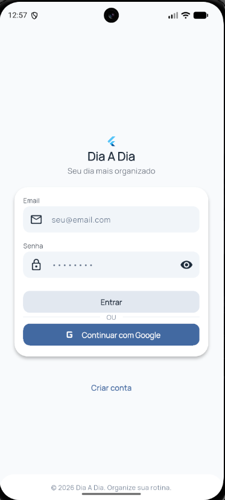

# Frontend — Login (FN0001)

Este documento descreve a implementação visual e o comportamento da interface de Autenticação.

## Objetivo da Tela
Prover uma interface limpa e segura para que o usuário realize o login no aplicativo.

## Status
- **UI**: Implementada (Material 3)
- **Integração**: Concluída com Supabase
- **Testes**: Suíte de Widget Tests concluída

## Wireframe


## Estrutura Visual
A tela segue uma disposição vertical centralizada:
1. **Logo e Cabeçalho**: Identidade visual do projeto.
2. **Formulário de Login**: Card contendo campos de texto e botão principal.
3. **Divisor**: Separação visual para métodos alternativos.
4. **Login Social**: Botão para acesso via Google.
5. **Rodapé**: Link para navegação para a tela de cadastro.

## Hierarquia de Widgets
```text
LoginPage (Scaffold)
 └── AuthHeader (Logo + Títulos)
 └── AuthCard (Container)
      ├── AuthTextField (E-mail)
      ├── AuthTextField (Senha + Toggle Visibilidade)
      ├── PrimaryButton (Entrar)
      ├── OrDivider ("ou")
      └── SocialLoginButton (Google)
 └── Link para Signup
```

## Componentes Reutilizáveis
- **AuthHeader**: Exibe a logo (`AppLogo`) e os textos de boas-vindas.
- **AuthTextField**: Campo customizado com suporte a prefix icon e validação visual.
- **PrimaryButton**: Botão com suporte a estado de `loading` (exibe CircularProgressIndicator).
- **SocialLoginButton**: Botão estilizado seguindo as diretrizes do Google.

## AppKeys Relevantes
Utilizadas para identificação em testes:
- `AppKeys.loginPage`
- `AppKeys.loginEmailField`
- `AppKeys.loginPasswordField`
- `AppKeys.loginButton`
- `AppKeys.googleLoginButton`
- `AppKeys.createAccountButton`

## Estados da Interface

### Idle
Estado padrão aguardando interação. O botão "Entrar" é habilitado apenas quando o formulário é válido.

### Loading
Acionado ao clicar em "Entrar" ou no botão do Google.
- O `PrimaryButton` exibe o widget de loading (`AppKeys.primaryButtonLoading`).
- Interações com os campos são bloqueadas.

### Error
Exibe o widget `ErrorMessage` com o feedback retornado pela ViewModel.

## Navegação Visual
- O clique em "Criar conta" aciona o `RouteNames.signup`.
- O sucesso na autenticação aciona o `RouteNames.home`.

## Testes de Widget
A tela possui cobertura para:
- Renderização correta de todos os componentes do `AuthCard`.
- Verificação do toggle de visibilidade da senha.
- Validação visual de mensagens de erro.
- Comportamento do botão de loading.
