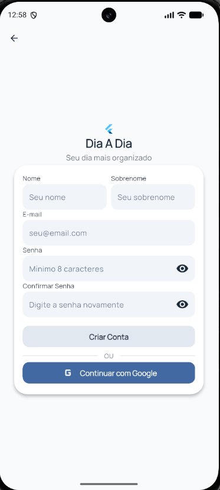

# Frontend — Cadastro (FN0002)

Este documento descreve a implementação visual e o comportamento da interface de Cadastro (Signup).

## Objetivo da Tela
Permitir que novos usuários se registrem no sistema de forma rápida, com feedback imediato sobre a validade dos dados informados.

## Status
- **UI**: Implementada
- **Integração**: Concluída
- **Testes**: Suíte de Widget Tests concluída

## Wireframe


## Estrutura Visual
A tela utiliza um layout de scroll para acomodar o formulário estendido:
1. **Cabeçalho**: Logo reduzida e título "Criar Conta".
2. **Card de Cadastro**: Agrupador dos campos de entrada.
3. **Formulário**:
    - Nome e Sobrenome (Campos individuais).
    - E-mail.
    - Senha e Confirmação de Senha (com toggle de visibilidade).
4. **Ação Principal**: Botão de cadastro.

## Hierarquia de Widgets
```text
SignupPage (Scaffold)
 └── SingleChildScrollView
      └── AuthHeader
      └── AuthCard
           ├── Column
                ├── AuthTextField (Nome)
                ├── AuthTextField (Sobrenome)
                ├── AuthTextField (E-mail)
                ├── AuthTextField (Senha)
                ├── AuthTextField (Confirmar Senha)
                └── PrimaryButton (Cadastrar)
```

## Componentes Reutilizáveis
- **AuthHeader**: Configurado para o contexto de cadastro.
- **AuthTextField**: Utilizado para todos os inputs, variando o `TextInputType` e as regras de validação visual.
- **PrimaryButton**: Gerencia o estado de loading durante a criação da conta.
- **AuthCard**: Mantém a consistência visual com a tela de login.

## AppKeys Relevantes
- `AppKeys.signupPage`
- `AppKeys.signupNameField`
- `AppKeys.signupLastNameField`
- `AppKeys.signupEmailField`
- `AppKeys.signupPasswordField`
- `AppKeys.signupConfirmPasswordField`
- `AppKeys.signupButton`

## Estados da Interface

### Idle
Campos vazios ou em preenchimento. O botão de cadastro é habilitado somente quando todos os critérios de validação (Nome, E-mail, Senha e Confirmação) são atendidos.

### Loading
Estado ativo durante a chamada ao Supabase.
- Exibe o spinner no `PrimaryButton`.
- Impede múltiplos cliques para evitar criações duplicadas.

### Error
Exibe mensagens de erro específicas abaixo dos campos ou via `ErrorMessage` no topo do card caso seja um erro de servidor (ex: e-mail duplicado).

## UX e Acessibilidade
- **Auto-scroll**: O uso de `SingleChildScrollView` garante que os campos inferiores fiquem visíveis mesmo com o teclado aberto.
- **Identificação**: Uso extensivo de `AppKeys` para facilitar a manutenção de testes automatizados.

## Navegação Visual
- O sucesso no cadastro redireciona para o `RouteNames.home`.
